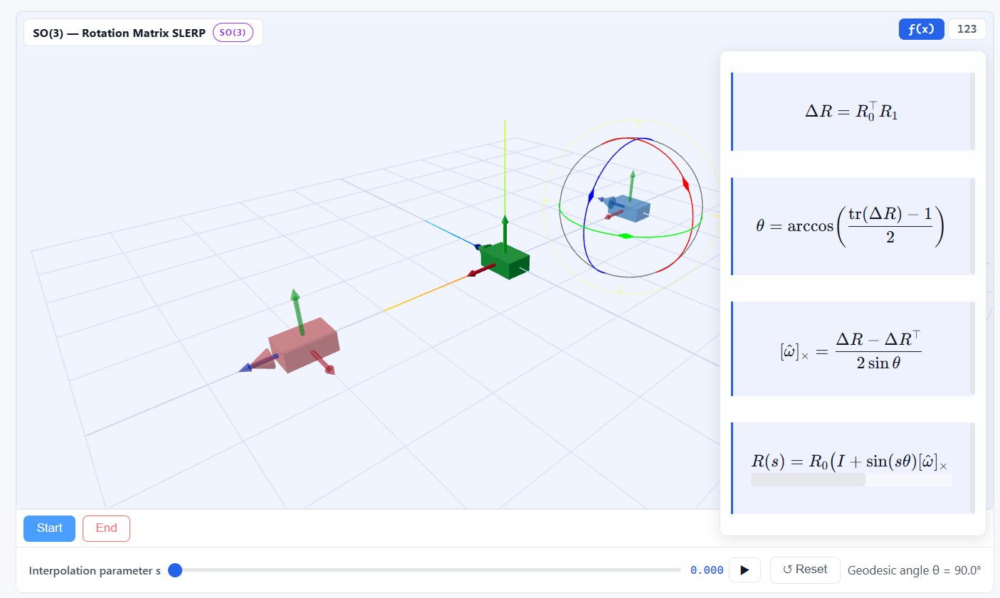

# 🎯 interp



> **Interactive visualization and exploration of advanced interpolation techniques in robotics and 3D graphics**

[](https://react.dev)
[](https://threejs.org)
[](https://www.typescriptlang.org)

This project provides beautiful, interactive demos for exploring interpolation on **SO(2)** (2D rotations), **SO(3)** (3D rotations), and **SE(3)** (3D rigid transformations). Perfect for learning rotational mathematics, comparing interpolation methods, and visualizing complex spatial concepts.

## ✨ Features

- **Interactive 3D Visualization** – Real-time 3D rendering with mouse-controlled transformations
- **Multiple Interpolation Methods** – Compare different interpolation techniques (NLERP, SLERP, scLERP, Dual Quaternion, etc.)
- **Multiple Representations** – Explore SO(2), SO(3) matrices, quaternions, and SE(3) transformations
- **Smooth Animation** – Animated interpolation playback with adjustable speed
- **Drag-based Control** – Intuitive circular drag input for angle and rotation manipulation
- **Educational Focus** – Learn the mathematics behind rotation and transformation interpolation

## 🚀 Quick Start

### Prerequisites
- **Node.js** 20+
- **pnpm** (or npm/yarn)

### Installation & Development

```bash
# Install dependencies
pnpm install

# Start development server (http://localhost:5173)
pnpm dev

# Build for production
pnpm build

# Preview production build locally
pnpm preview
```

## 🌐 GitHub Pages Deployment

This repository includes automated CI/CD through GitHub Actions that deploys to GitHub Pages on every push to `main`.

**Setup (one-time):**
1. Go to your repository **Settings > Pages**
2. Under "Build and deployment", select **GitHub Actions** as the source
3. Save the settings

After that, every push to `main` automatically publishes your updates! 🚀

**Details:**
- Workflow file: `.github/workflows/deploy-pages.yml`
- Build output: `dist/`
- Base path configuration: `vite.config.ts`

## 📝 Configuration

> **Note:** Vite is configured to use `/interp/` as the base path for GitHub Pages builds to ensure static assets resolve correctly. Local development still runs at `/`.

If you rename the repository, update the base path in [vite.config.ts](vite.config.ts).

## 🛠️ Tech Stack

- **Frontend Framework:** React 18 + TypeScript
- **3D Graphics:** Three.js
- **Build Tool:** Vite
- **Styling:** CSS Modules
- **Math Libraries:** Custom implementations of quaternion, SE(3), SO(3) math

## 📚 Learning Resources

This project is ideal for:
- **Students** learning rotational mathematics and Lie groups
- **Roboticists** seeking to understand transformation interpolation
- **Graphics Developers** exploring quaternion-based rotation techniques
- **Anyone curious** about advanced interpolation methods

## 📄 License

Check the repository for [license](LICENSE) details.
